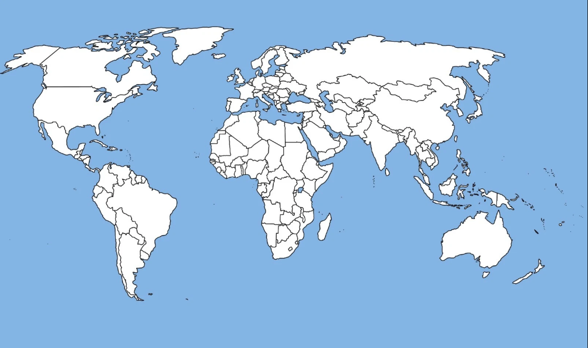
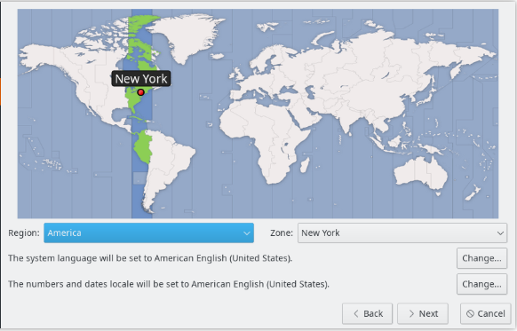

# 🚀 GoOS Installer Interface


Este repositório contém a **interface gráfica de instalação** do **GoOS**, um sistema operacional em desenvolvimento. O instalador foi projetado para ser intuitivo, moderno e funcional, guiando o usuário por todas as etapas necessárias para preparar o ambiente antes da primeira inicialização.

---

## 🎨 Visual & Design

O instalador segue uma estética moderna com o uso de **Rosa Neon (`#ff0058`)** para destaques e uma interface limpa e escura para as barras de título, proporcionando um contraste elegante e de alta legibilidade.

---

## ✨ Funcionalidades

O fluxo de instalação é dividido em etapas claras e seguras:

1.  **Boas-vindas & Idioma:** Seleção do idioma preferencial para o sistema.
2.  **Localização (Timezone):** Configuração de região e fuso horário com auxílio visual de um mapa mundi.
3.  **Gerenciamento de Discos:**
    *   Listagem detalhada de unidades disponíveis (Modelo, Capacidade, Sistema de Arquivos).
    *   **Danger Zone:** Aviso explícito sobre formatação e perda de dados.
    *   Confirmação obrigatória dos termos antes de prosseguir.
4.  **Progresso de Instalação:** Visualização em tempo real do status da cópia de arquivos e configuração do sistema.

---

## 🛠️ Tecnologias Utilizadas

*   **Linguagem:** Java 17
*   **Framework de UI:** JavaFX 21
*   **Gerenciador de Dependências:** Maven
*   **Estilização:** CSS customizado para componentes JavaFX

---

## 📂 Estrutura do Projeto

*   `src/main/java/org/example/controller/`: Lógica de controle de cada tela.
*   `src/main/resources/view/`: Arquivos FXML que definem a interface.
*   `src/main/resources/css/`: Estilos visuais globais.
*   `src/main/resources/images/`: Assets visuais (mapas, logos).

---

## 🚀 Como Executar

Para rodar o instalador localmente em seu ambiente de desenvolvimento:

1.  Certifique-se de ter o **JDK 17+** e **Maven** instalados.
2.  Clone o repositório.
3.  Execute o seguinte comando na raiz do projeto:

```bash
mvn javafx:run
```

---

## 📸 Screenshots (Exemplo)

> [!TIP]
> *Aqui você pode adicionar as imagens presentes na pasta `resources/images` ou capturas de tela da aplicação rodando.*

| Tela de Boas-vindas | Seleção de Fuso Horário | Seleção de Disco |
| :---: | :---: | :---: |
|  |  |  |

---

## ⚙️ Parte de um Ecossistema

Este projeto é **exclusivamente a interface do instalador**. Ele faz parte do ecossistema **GoOS**, servindo como a porta de entrada para o usuário final.

---

<p align="center">
  Desenvolvido com ❤️ por [Gustavo Coraleski]
</p>
